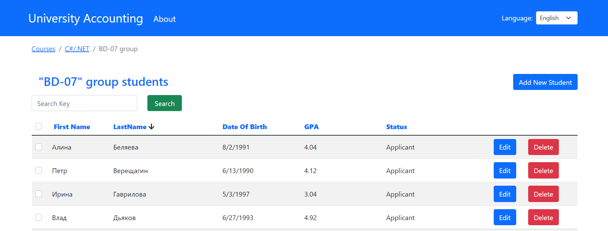
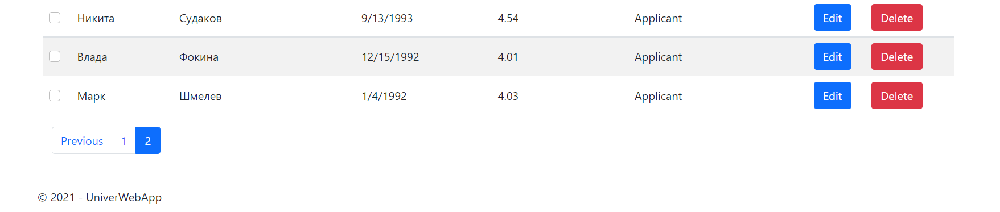

# University records about students
Web application for keeping records of students. It allows you to add, delete and update student records, assign them to courses and groups.

## Table of Contents
* [General Info](#general-information)
* [Technologies Used](#technologies-used)
* [Features](#features)
* [Screenshots](#screenshots)
* [Contact](#contact)

## General Information
- The application allows you to perform CRUD operations on students, groups and courses.
- Convenient navigation by groups and courses is implemented, listings are paginated.
- Ability to search for desired records and filtering by columns has been implemented.
- The application supports English, Russian and Arabic.

## Technologies Used
- ASP.NET Core - version 5.0
- Entity Framework Core - version 5.0
- MVC, Repository and Unit-of-work patterns
- Bootstrap - version 5.1
- jQuery
- Automapper
- NLog
- SmartBreadcrumbs
- xUnit
- Moq
- FluentAssertions
- Selenium

## Features
List the ready features here:
- Multilingual localization and globalization
- Breadcrumbs for navigation
- Operation notifications
- Search by keyword in the list
- Sorting records by column
- Deleting multiple entries at once
- Server side and client side validation
- Records pagination

## Screenshots

## Contact
Created by [@Dmitriy Bulynko](https://linkedin.com/in/дмитрий-булынко-10bb53227) - feel free to contact me!
